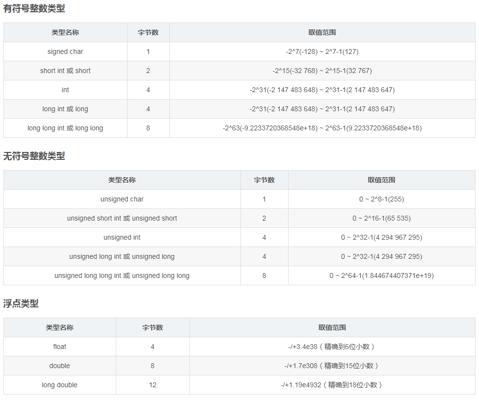

# C语言基础速成（到数组）

## 如何学好C语言？
* 学会使用搜索引擎（关键字搜索：C printf 比 c语言printf搜索到的内容更多（但不一定会更好））

* 接受编程，接受这种垃圾模式（虽然有更好的语言，但既然你要学就接受它吧，别给自己找苦吃）
* ### 练习

## 什么是C语言？
* 是一种用来编程的代码。

## 什么是代码？
* 代码就是人类为了更好表达某一种事物而抽象的概念。

* 我可以指着鹿说它是马。~~（我说他是他就是！）~~ :horse:

* 好吧其实是在一定范围内规定的一种代号（密码学的味道来了）

## C语言是什么代码?
* 是神 ~~（垃圾）~~ :grey_question:

## 我能用C语言做什么呢？
* 在计算机上，别人能做到的所有事情你也可以

* 造系统

* 写作业（帮你算数学题）

* ~~下片~~ :grey_exclamation:

## C语言如何运作的？

### 先来说编译到底是个啥

* 计算机本质就是大型的逻辑电路系统，然后因为它是用0和1来表达状态的（关和开），<br>所以“计算机运行中一切数据都是二进制”，~~C语言能操作二进制的内容~~（废话）

* C语言从人写的“源代码”（人手写的能看的就叫源码），到机器能跑的机器码（那是学硬件的搞的，有兴趣可以自己查）。

  1. 首先我们接触到的所有程序，其实都是套娃的模式。所以你写的程序只是 __大程序（操作系统）__ 下的 __小程序__ 。
  
  2. 为了让硬件能够运行我们的代码，源代码会被操作系统的 __某个编译器（取决于你用的是啥__ 翻译成 中间代码。
  
  3. 中间代码还会被继续被翻译。（但不重要，这意味着编译是有很多步的）
  
  4. 最终你的程序会变成一大堆操作硬件的指令和二进制。
  
----

### 再来说C语言的程序会怎么运作
* 操作系统会空出一些资源，然后自己识别你程序的main部分（成为程序后，main会被翻译为 __操作系统\[又称平台\]__ 的程序入口）<br>
  这就是为什么常说程序能在某个平台上运行的其中一个原因。（实际上有些代码会用到部分平台的 __特性__ ）
```C
int main(){
  return 0;
} 
//main函数看腻了吧？记得分号要是英文的，return 0;一定要写哦！
``` 
* 接着会给你分配资源：内存、线程优先级、输入输出流...

* 然后你就可以操作程序/机器可以操作程序

### 然后你的程序就:fire:活:fire:起来啦！

## C语言在我们这个水平需要掌握哪些硬件一点的操作呢？
* ~~寄存操作~~ （寄存器，肯定不用掌握啦）
*  内存操作 （运行内存RAM）
*  缓存操作 （内存到储存的中间步骤，实际上是一小块内存）
*  储存操作 （机械硬盘HDD、储存芯片SSD）
*  I/O操作  （就是input、output）

## 好啦现在我们开始入门吧！

### 关键字
这个就是指C语言当中已经被定义了内涵的内容<br>

比如说“if”。<br>

关键字不能被占用且有特殊的意义

有哪些关键字呢？
详见链接：
https://www.runoob.com/cprogramming/c-basic-syntax.html

### 头与宏
```C
#include<stdio.h>

include是包含的意思。
意思就是说把别人写的源码包含进来。注意是源码！
一般头文件是.h结尾的，h的意思是head。
也有人喜欢用.c。 但是标准化的做法都是.h，现阶段写的程序都是include xxx.h的。
现在你知道
#include<stdio.h> //操作输入输出流的头文件
为什么一定要写了吧？（难不成你还要手捏输入输出流？？？ 我不行我不上）

///////////////////////////////////////

#define A B
这个叫做定义，或者是宏。
是把其后的所有的A替换成B

很简单吧？

```

### 变量和数据类型

#### 变量
变量声明格式: 修饰 类型 变量名;
变量声明且赋值格式：修饰 类型 变量名 = 数据;

修饰有很多 其中常用的是 long、const

const表示后面的数据是常量。

long表示后面数据内存空间是加长的（在现在的计算机里面，long int、long、int应该都是指4byte的整数）

##### 作用域
这是啥呢？ 这就是爱吧。<br>

好吧作用域表示变量的作用范围，非常直观的名字才对。<br>

有局部，全局，形参三种情况，这里只介绍局部和全局。<br>

局部变量是指在块状代码内生效，出去就不知道何去何从的；<br>
全局变量是指在main之上#include以下的变量，不论到哪里都是有效的；<br>

你想要它有效可以使用指针操作，后面也不会讲2333（x

:pushpin: 如果你在局部又定义了一个和全局同名的变量，然后再访问，如果没有报错的话，应该是只能 访问/操作 同名的局部变量。<br>

详情请见：https://www.runoob.com/cprogramming/c-scope-rules.html

有些错误会莫名其妙因为作用域的原因而导致，请务必把这个记在心中。

#### 数据类型
我们知道计算机中数据都是用二进制来储存和处理的，所以我们就要以二进制的方式去理解。

现在我们有010101000000111

每一位叫做 __bit（字）__ ~~/（霍比特人？）~~ <br>
每四个位（一起）叫做 __Byte（字节）__ <br>

如果我们不考虑符号的话，4byte能表示的整数范围为：0~2^32 (正负号占一位，所以是0~(2^31)-1)<br>



##### 为什么需要声明这种写法？
声明允许你写函数（后面有提到）和写变量的时候不需要马上为它加入内容。<br>
如果只允许你直接写的话，一个是不够灵活，另一个是不利于你码代码的组织。<br>
试想：如果你有20个变量，每个变量类型都有，每个变量必须要赋值才能够使用。你怎么样把它写的好看？


### 构成体（这个是我为了让大家更快理解C语言自己抽象的概念，实际上并不存在）
构成体呢，就是构成块状语句集合的一个抽象概念，干讲很累的，所以————上代码！

```C
构成体第一种：

  keyword(表达式){
  
    代码;
    代码;
    
  }
  
  //这个for、if、while都是这样的
  
//////////////////////////////////////////
构成体第二种：

  keyword name(表达式){
  
    代码;
    代码;
    
  }
  
  //函数是这样的
  
//////////////////////////////////////////
构成体第三种：

  keyword{
  
    代码;
    代码;
    
  }(表达式)
  
  //do-while是这样的
```
想知道更多请去：https://www.runoob.com/cprogramming/c-basic-syntax.html

### 运算符

好这个不讲，直接上链接（偷懒跑路）：https://www.runoob.com/cprogramming/c-operators.html

好吧讲一下：

“=” 是赋值运算符，
“==” 才是判断相等的运算符！

“/” 除法在int型里面是只要商的整数部分的，在float型里面是保留小数的。

别错了！

### 条件判断 https://www.runoob.com/cprogramming/c-decision.html

条件判断很简单，判断()中的表达式是否为1，如果是就执行{}的内容，当然switch除外。

switch比较特别，建议大家看看书和链接，我这里不好细讲（反正我自己也不怎么用）

switch基础内容：https://www.runoob.com/cprogramming/c-switch.html

switch妙用：https://segmentfault.com/a/1190000007064507

switch判断范围：https://blog.csdn.net/weixin_43342054/article/details/85596192

这里还有一个“三元表达式”：

(条件)?(为真执行):(为假执行)

其实就是同ifel是一个道理的。

### 循环结构 https://www.runoob.com/cprogramming/c-loops.html

这是在vsc上直接对代码讲的。

注意 i++ 和 ++i 的区别：

i++; 指的是该条语句之后的操作访问 i 时，i = i + 1
++i; 指的是该条语句时 i 就已经时 i = i + 1 了

### 数组 https://www.runoob.com/cprogramming/c-arrays.html

:pushpin: 下标n是从零开始的。

### 函数 https://www.runoob.com/cprogramming/c-functions.html

:pushpin: 函数写在main之后要现在main前声明。

（这下30分钟内能速成了吧？）

### 简单输入输出 https://www.runoob.com/cprogramming/c-input-output.html

printf 其实是 print function，

缩写就叫printf

printf("格式化字符",对应格式化字符的参数);

scanf 其实就是 scan function，

缩写就叫scanf

scanf("格式化字符",&对应格式化字符的参数);

& 是什么？
& 是运算符的一种，叫做寻址符。
比如：
&a
就会找到内存中a所在的 __内存地址__

在scanf里面就是揪出变量a的地址，然后再把数据塞进去。

因为c语言里面有作用域的限制，所以跨域访问变量只能使用 __指针__ 的方式了

& 就是指针操作里面的常用运算符，同时还有 *

喜欢的同学可以自行学习指针： https://www.runoob.com/cprogramming/c-pointers.html

最后，我懒得写了。
然后，写的可能有很多问题，希望懂的人能直接在issues里面指出，或者说提醒我都可以。

最后最后的最后，附上一篇给小同学们的好资源：

如何科学有效的提问 ：https://github.com/ryanhanwu/How-To-Ask-Questions-The-Smart-Way/blob/master/README-zh_CN.md
