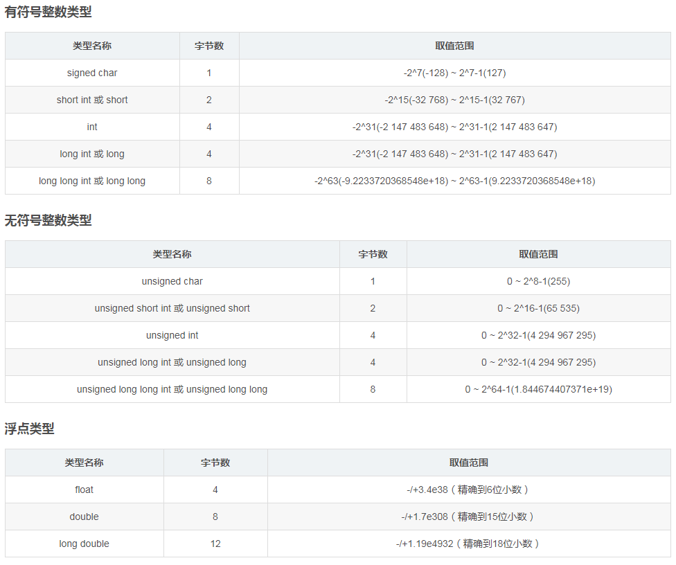

# C语言基础速成（到数组）

## 如何学好C语言？
* 学会使用搜索引擎（关键字搜索：C printf 比 c语言printf搜索到的内容更多（但不一定会更好））

* 接受编程，接受这种垃圾模式（虽然有更好的语言，但既然你要学就接受它吧，别给自己找苦吃）
* ### 练习

## 什么是C语言？
* 是一种用来编程的代码。

## 什么是代码？
* 代码就是人类为了更好表达某一种事物而抽象的概念。

* 我可以指着鹿说它是马。~~（我说他是他就是！）~~

* 好吧其实是在一定范围内规定的一种代号（密码学的味道来了）

## C语言是什么代码?
* 是神 ~~（垃圾）~~

## 我能用C语言做什么呢？
* 在计算机上，别人能做到的所有事情你也可以

* 造系统

* 写作业（帮你算数学题）

* ~~下片~~

## C语言如何运作的？

### 先来说编译到底是个啥

* 计算机本质就是大型的逻辑电路系统，然后因为它是用0和1来表达状态的（关和开），<br>所以“计算机运行中一切数据都是二进制”，~~C语言能操作二进制的内容~~（废话）

* C语言从人写的“源代码”（人手写的能看的就叫源码），到机器能跑的机器码（那是学硬件的搞的，有兴趣可以自己查）。

  1. 首先我们接触到的所有程序，其实都是套娃的模式。所以你写的程序只是 __大程序（操作系统）__ 下的 __小程序__ 。
  
  2. 为了让硬件能够运行我们的代码，源代码会被操作系统的 __某个编译器（取决于你用的是啥__ 翻译成 中间代码。
  
  3. 中间代码还会被继续被翻译。（但不重要，这意味着编译是有很多步的）
  
  4. 最终你的程序会变成一大堆操作硬件的指令和二进制。
  
----

### 再来说C语言的程序会怎么运作
* 操作系统会空出一些资源，然后自己识别你程序的main部分（成为程序后，main会被翻译为 __操作系统\[又称平台\]__ 的程序入口）<br>
  这就是为什么常说程序能在某个平台上运行的其中一个原因。（实际上有些代码会用到部分平台的 __特性__ ）
```C
int main(){
  return 0;
} 
//main函数看腻了吧？记得分号要是英文的，return 0;一定要写哦！
``` 
* 接着会给你分配资源：内存、线程优先级、输入输出流...

* 然后你就可以操作程序/机器可以操作程序

### 然后你的程序就:fire:活:fire:起来啦！

## C语言在我们这个水平需要掌握哪些硬件一点的操作呢？
* ~~寄存操作~~ （寄存器，肯定不用掌握啦）
*  内存操作 （运行内存RAM）
*  缓存操作 （内存到储存的中间步骤，实际上是一小块内存）
*  储存操作 （机械硬盘HDD、储存芯片SSD）
*  I/O操作  （就是input、output）

## 好啦现在我们开始入门吧！

### 头与宏
```C
#include<stdio.h>

include是包含的意思。
意思就是说把别人写的源码包含进来。注意是源码！
一般头文件是.h结尾的，h的意思是head。
也有人喜欢用.c。 但是标准化的做法都是.h，现阶段写的程序都是include xxx.h的

///////////////////////////////////////

#define A B
这个叫做定义，或者是宏。
是把其后的所有的A替换成B

很简单吧？

```

### 变量和数据类型

#### 变量
变量声明格式: 修饰 类型 变量名;
变量声明且赋值格式：修饰 类型 变量名 = 数据;

#### 数据类型
我们知道计算机中数据都是用二进制来储存和处理的，所以我们就要以二进制的方式去理解。

现在我们有010101000000111

每一位叫做 __bit（字）__ ~~/（霍比特人？）~~ <br>
每四个位（一起）叫做 __Byte（字节）__ <br>

如果我们不考虑符号的话，4byte能表示的整数范围为：0~2^32 <br>



##### 为什么需要声明这种写法？
声明允许你写函数（后面有提到）和写变量的时候不需要马上为它加入内容。
如果只允许你直接写的话，一个是不够灵活，另一个是不利于你码代码的组织。
试想：如果你有20个变量，每个变量类型都有，每个变量必须要赋值才能够使用。你怎么样把它写的好看？
